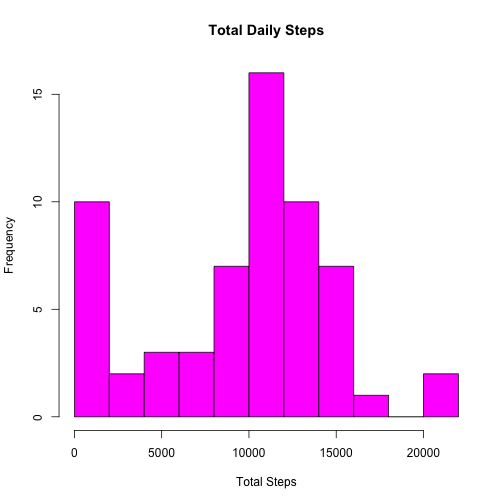
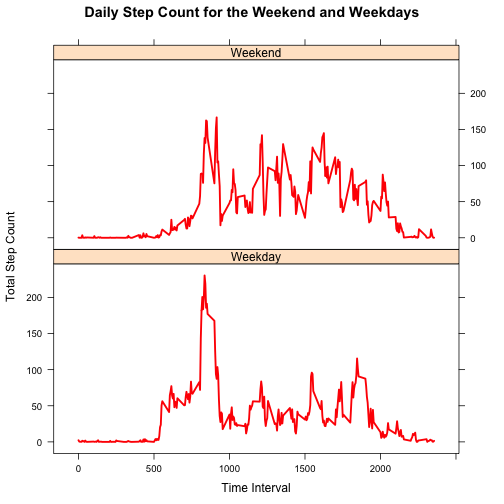

# Loading and preprocessing the data  
1.Here we want to first load the data set  


```r
setwd('/Users/rek514/Documents/Data_science/Git_hub/RepData_PeerAssessment1')

# Load in packages needed for later
library(dplyr)
library(lattice)

# Stops numbers being shown in Scientific notation and set decimal places to 3
options(scipen=99999, digits=3)

# Load dataset into R
dataset <- read.csv('activity.csv')
# Convert the date column into a date data class
dataset$date <- as.Date(as.character(dataset$date, format = '%Y/%m/%d'))
```

# What is the mean total number of steps taken per day?

1. First we need to find the total number of steps per day

```r
# Group the data by date
date_grouped <- group_by(dataset, date)
# Calculate the total sum of steps for each day
step_total <- summarise(date_grouped,Steps=sum(steps, na.rm = TRUE))
```

2. Next we want to generate a histogram of these step totals.

```r
# Create a histogram with the total step data
hist(step_total$Steps,breaks=15, col='magenta', main = 'Total Daily Steps',
     xlab='Total Steps', ylab ='Frequency')
```



3. Finally we want to find the mean and median number of daily steps

```r
# Calculate the mean and median for the daily step total
stepmean <- mean(step_total$Steps)
stepmedian <- median(step_total$Steps)
```
The  **mean** daily step count is 9354.23 and the **median** is 10395.


# What is the average daily activity pattern?
1.First we want to plot the average number of steps taken across the whole day.


```r
# Group the data by interval
interval_grouped <- group_by(dataset, interval)
# Calculate the total sum of steps for each interval during the day
intstep_total <- summarise(interval_grouped,Steps=mean(steps, na.rm = TRUE))
# Plot a line graph to show the step count across the day
plot(x=intstep_total$interval, y=intstep_total$Steps, type='l',
     main='Average step count across the day', xlab='Interval', ylab='Total Steps', lwd=2.5, col='blue')
```


2. Next we want to find out during which time point were the most steps taken?

```r
intervalmax <- intstep_total$interval[which.max(intstep_total$Steps)]
```
In this individual, they made the most steps during the 835th interval.

# Imputing missing values

1. Calculate and report the total number of missing values in the dataset (i.e. the total number of rows with 𝙽𝙰s)

```r
missingtotal <- sum(is.na(dataset$steps))
```
The total number of missing values is 2304.

3. We now want to replace these missing values with the mean for that corresponding interval. These are saved in a new data set.

```r
# Create a new data set
na_dataset <- dataset
# Loop through each of the data set entries
for (i in 1:(dim(na_dataset)[1])) {
  # Check if the steps value is NA
  if (is.na(na_dataset$steps[i])) {
    # Find the correct interval index value
    interval_index <- match(na_dataset$interval[i], intstep_total$interval)
    # Replace the NA with the interval mean value
    na_dataset$steps[i] <- intstep_total$Steps[interval_index] }
  else {}}
```

4.Finally we want to calculate the total mean and median number of steps per day  and plot the total daily step count in a histogram.


```r
# Group the data by date
date_grouped <- group_by(na_dataset, date)
# Calculate the total sum of steps for each day
na_step_total <- summarise(date_grouped,Steps=sum(steps, na.rm = TRUE))

# Calculate the mean and median for the daily step total
new_stepmean <- mean(na_step_total$Steps)
new_stepmedian <- median(na_step_total$Steps)

# Create a histogram with the total step data
hist(na_step_total$Steps,breaks=15, col='yellow', main = 'Total Daily Steps',
     xlab='Total Steps', ylab ='Frequency')
```


The new **mean** daily step count is 10766.189 and the **median** is 10766.189.  
This clearly shows that the presence of the missing values in the original data set has shifted the overall mean daily step count down by 1411.959 steps.   
Filling these missing values in has also meant the current data show a **normal distribution** (no skew) where the median and mean are the same. Previously, the missing values caused the data to show a **negative skew**.

# Are there differences in activity patterns between weekdays and weekends?

1.Create a new factor variable in the dataset with two levels – “weekday” and “weekend” indicating whether a given date is a weekday or weekend day.


```r
# Add a new empty column and name it 'Weekday'
na_dataset[,4] <- NA
colnames(na_dataset)[4] <- 'Weekday'

# Loop through each of the data set entries

for (i in 1:(dim(na_dataset)[1])) {
  # Check if the day is a saturday or sunday
  if ((weekdays(na_dataset$date[i]) == 'Saturday')|(weekdays(na_dataset$date[i]) == 'Sunday')){
    # If so, label as a weekend
    na_dataset$Weekday[i] <-  'Weekend'}
  # If not a weekend, label as a weekday
  else {na_dataset$Weekday[i] = 'Weekday'}}

#Convert to a factor variable
na_dataset$Weekday <- as.factor(na_dataset$Weekday)
head(na_dataset)
```

```
##    steps       date interval Weekday
## 1 1.7170 2012-10-01        0 Weekday
## 2 0.3396 2012-10-01        5 Weekday
## 3 0.1321 2012-10-01       10 Weekday
## 4 0.1509 2012-10-01       15 Weekday
## 5 0.0755 2012-10-01       20 Weekday
## 6 2.0943 2012-10-01       25 Weekday
```

Above are the top 6 cases of the new data set with the additional **Weekday** variable.

2. We now want to see graphically whetehr the average steps at each interval period vary between weekend days and weekdays.


```r
# Group data by weekend variable and interval
weekday_grouped <- group_by(na_dataset, Weekday, interval)
# Daily step total for each weekday variable and interval
weekend_step_total <- summarise(weekday_grouped,Steps=mean(steps, na.rm = TRUE))

#Create a panel plot to show weekend and weekday data seperatly.
xyplot(weekend_step_total$Steps ~ weekend_step_total$interval | weekend_step_total$Weekday, type='l', layout=c(1,2), xlab = 'Time Interval', ylab = 'Total Step Count', lwd=2.5, col='red', main='Daily Step Count for the Weekend and Weekdays')
```


